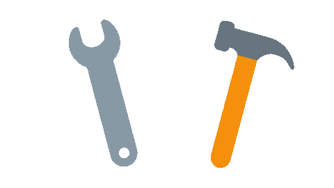

  <h1>
    Hello World !
  </h1>  
  
  &nbsp;&nbsp;&nbsp;
  
  &nbsp;&nbsp;&nbsp;
  
  &nbsp;&nbsp;&nbsp;
  
  &nbsp;&nbsp;&nbsp;
  
  &nbsp;&nbsp;&nbsp;
  
  &nbsp;&nbsp;&nbsp;
  
  &nbsp;&nbsp;&nbsp;
  
   

  
  &nbsp;&nbsp;&nbsp;
  
  &nbsp;&nbsp;&nbsp;
  
  &nbsp;&nbsp;&nbsp;
  
  &nbsp;&nbsp;&nbsp;
  
  &nbsp;&nbsp;&nbsp;
  
  &nbsp;&nbsp;&nbsp;
  

   
  
   
  
  
  &nbsp;&nbsp;&nbsp;
  
  &nbsp;&nbsp;&nbsp;
  
  &nbsp;&nbsp;&nbsp;
  
  &nbsp;&nbsp;&nbsp;
  
  &nbsp;&nbsp;&nbsp;
  
  &nbsp;&nbsp;&nbsp;
  
  &nbsp;&nbsp;&nbsp;
  
   

  
  &nbsp;&nbsp;&nbsp;
  
   &nbsp;&nbsp;&nbsp;
  
  &nbsp;&nbsp;&nbsp;
  
  &nbsp;&nbsp;&nbsp;
  
  &nbsp;&nbsp;&nbsp;
  
  &nbsp;&nbsp;&nbsp;
  
  

  
<h1 align="center">Hi 👋, I'm Kevin Escobar</h1>
<h3 align="center">"Writing SQL is like solving a puzzle: each well-constructed query is a key piece that reveals the full picture of your data."</h3>

  

## 🏆 GitHub Trophies

- 🔭 I’m currently working on Kata Software ESA [Cartera Digital](https://cartera-digital.com/)

- 🤝 I’m looking for help with **Android Development**

- 👨‍💻 All of my projects are available at (in progress) ⚙️🚧🏗️

- 💬 Ask me about **SQL, .Net, JS, Kotlin**

- 📫 How to reach me **kevinescobardevs@gmail.com**

- 📄 Know about my experiences [https://www.linkedin.com/in/kevin-escobarsv/](https://www.linkedin.com/in/kevin-escobarsv/)

- ⚡ Fun fact **I Like To Be In Constant Learning**
 
<h3 align="left">Connect with me:</h3>

<h3 align="left">Languages and Tools:</h3> 

                                         

### ✍️ Random Dev Quote

### 🔝 Top Contributed Repo

 
 

